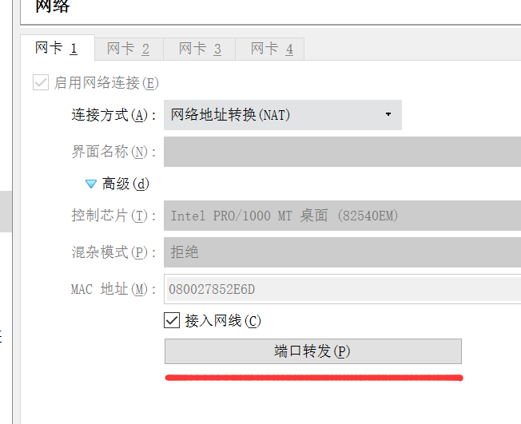
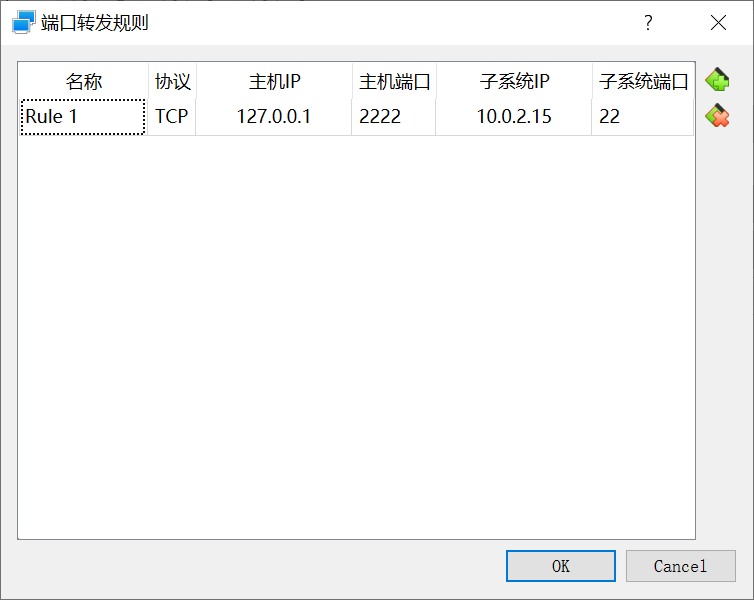

# Centos7 Hadoop部署

## 使用XShell连接虚拟机

### 安装openssh-server

先检查是否已经安装了openssh-server

```shell
yum list installed | grep openssh-server
```

如果没有安装的话，使用yum安装(可能需要配置镜像源)

```shell
yum install openssh-server
```

修改配置

```shell
sudo vim /etc/ssh/sshd_config
```

将下面几项的注释去掉

```shell
Port 22

ListenAddress 0.0.0.0

ListenAddress ::

PermistRootLogin yes

PasswordAuthentication yes
```

开启服务

```shell
service sshd start
```

检查服务是否开启

```shell
ps -e | grep sshd
```

## 网络设置

添加端口转发



将子系统的22端口转发到本机的2222端口
子系统IP可以通过输入`ifconfig`查看



之后使用xshell 连接本机的2222端口即可

## Jdk 安装

[教程链接](https://cloud.tencent.com/developer/article/1341059)

## hadoop安装

到[官网](https://hadoop.apache.org/releases.html)下载，下载binary版。使用xftp将压缩包传到虚拟机上，我就放在了`/usr/local/hadoop/`下面。

解压并删除压缩包

```shell
cd Desktop/
tar -xzf hadoop-2.10.1.tar.gz
rm hadoop-2.10.1.tar.gz
```

## 配置环境变量

```shell
sudo vim /etc/profile
```

添加以下几行

```shell
export HADOOP_HOME=/usr/local/hadoop/hadoop-2.10.1
export PATH=$PATH:$HADOOP_HOME/bin
export PATH=$PATH:$HADOOP_HOME/sbin
```

使修改生效

```shell
source /etc/profile
```

## 修改hadoop配置

```shell
cd /usr/local/hadoop/hadoop-2.10.1/etc/hadoop/
sudo vim core-site.xml
```
