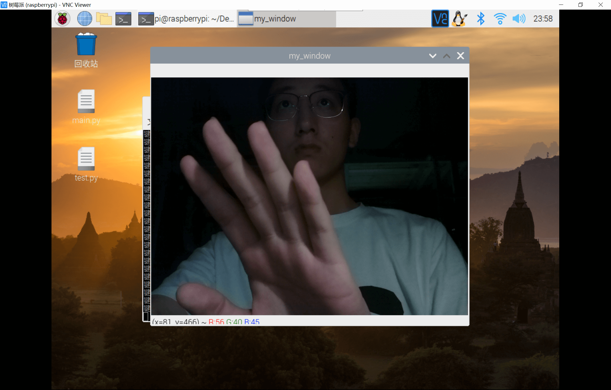

# 树莓派OpenCV环境搭建

## 更新软件源和国内镜像

此处就不赘述了。

## 安装依赖

```bash
sudo apt-get upgrade
sudo apt-get install libhdf5-dev libhdf5-serial-dev
sudo apt-get install libqtgui4 libqtwebkit4 libqt4-test python3-pyqt5
sudo apt-get install libatlas-base-dev
sudo apt-get install libjasper-dev
```

## 安装OpenCV

直接使用pip安装的话，会相当龟速，最好的是直接将文件下载到本地再安装。

[下载地址（自备梯子）](https://link.zhihu.com/?target=https%3A//www.piwheels.org/simple/opencv-contrib-python/opencv_contrib_python-3.4.3.18-cp37-cp37m-linux_armv7l.whl)

下载后传到树莓派桌面，可以使用VNC的文件传输功能，或者XFTP。

```bash
cd /home/pi/Desktop
sudo pip3 install opencv_contrib_python-3.4.3.18-cp37-cp37m-linux_armv7l.whl
```

## 其他方法

在知乎看到有人说一条指令解决，`sudo apt-get install python3-opencv`，有机会试一试。

## 示范代码

```pyhton
import cv2


cap = cv2.VideoCapture(0)
cap.open(0)


while cap.isOpened():

    flag, frame = cap.read()
    frame = cv2.flip(frame, 0)
    cv2.imshow('my_window', frame)
    strInput = cv2.waitKey(60)
    print(strInput)
    if strInput == 27:
        break

cap.release()
cv2.destroyAllWindows()
```

在使用VNC的情况下，按`esc`键并没有停止。可能得直接使用外接键盘？


