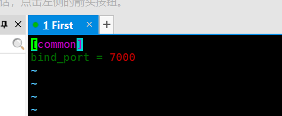

# 用树莓派搭建宿舍监控

用树莓派搭建宿舍监控，好像没啥必要🤔🤔🤔
其实就是买了个摄像头，先试着用一下，这个相当于是一个试水作品。

硬件平台：树莓派4B 腾讯云Centos7学生机 树莓派官方摄像头

<!--more-->
## 环境搭建

### 一、开启VNC


### 二、在VNC Viewer中访问树莓派桌面

在自己的电脑上下载VNC Viewer，在地址栏里输入树莓派IP，之后会让你输入用户名和密码（就是pi和xxxx你自己设的密码），然后就可以了


### 三、frp内网穿透

当然，要想内网穿透，得先来一个有公网IP的云服务器，我用的是腾讯云的学生机

#### 云服务器配置

1、在云服务器下载frp

```bash
wget https://github.com/fatedier/frp/releases/download/v0.21.0/frp_0.21.0_linux_amd64.tar.gz
tar -xzvf frp_0.21.0_linux_amd64.tar.gz #解压
```

**注意要删除和frpc相关的文件，只留下frps的相关文件**
2、配置frps.ini

```bash
cd frp_0.21.0_linux_amd64
sudo vim frps.ini
```



3、后台启动

```bash
nohup ./frps -c frps.ini &              #后台运行
```

#### 树莓派frp配置

1、下载frp
我是直接去网站下载的，然后它在Download/文件夹下，解压完，删掉frps的相关文件即可
2、配置frpc.ini

```bash
sudo nano frpc.ini


[common]
server_addr = 你云服务器的IP
server_port = 7000      #先前绑定的端口
login_fail_exit = false

[ssh]
type = tcp
local_ip = 127.0.0.1
local_port = 5900       #VNC的端口
remote_port =5900       #对应的云服务器的端口
```

3、后台运行

```bash
后台启动: nohup ./frpc -c ./frpc.ini &
```

这样就可以在VNC Viewer里用公网IP来访问树莓派了

## 摄像头配置

### 接入摄像头

```bash
sudo raspi-config
# 进入选项5
```

**Enable Camera**


## motion配置

### 1、安装motion

```bash
sudo apt-get install motion
```

### 2、motion配置

```bash
sudo vim /etc/motion/motion.conf
```

需要改写这些部分

```yml
stream_maxrate 200  提高传输速度

width 800

height 600

framerate 100
```

## 开启motion

```bash
sudo motion
```


### 关闭监控

```bash
sudo killall -TERM motion
```

## 提醒：为了您的人身安全，请不要偷拍室友

## 感谢阅读
